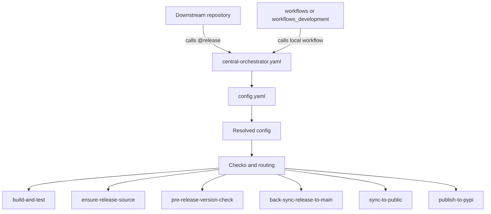
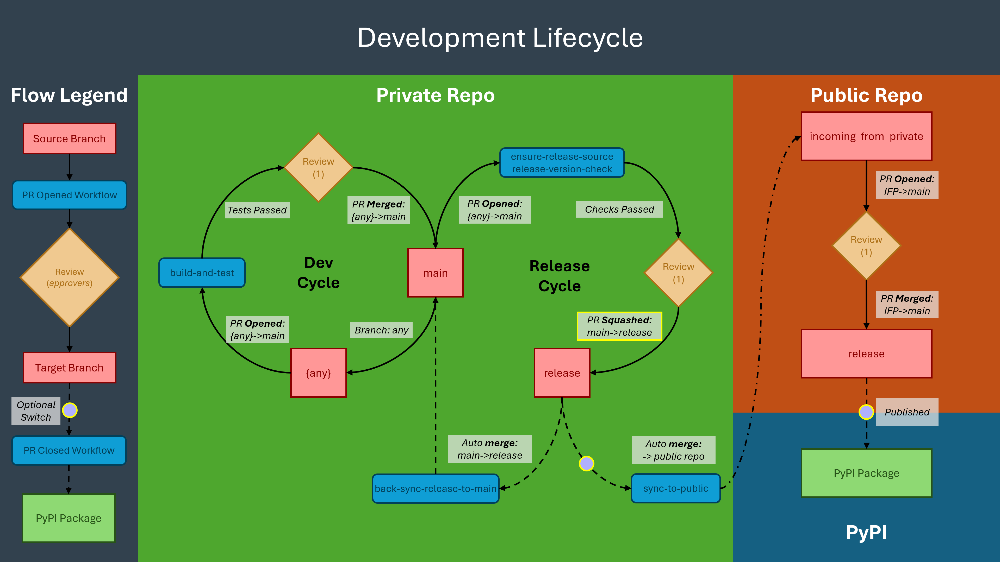

  

# DAIR CI/CD Workflows

Centralised reusable GitHub Actions workflows for DAIR repositories.

This package is the CI/CD control layer for private development, public release, and downstream reuse.

## What This Package Does

- Applies consistent CI/CD checks across repositories.
- Enforces release-source and version rules.
- Automates private to public promotion.
- Supports stable downstream consumption and live internal development.

## How It Is Used

### Downstream repositories use stable release workflows

Downstream repositories call:

- `SETT-Centre-Data-and-AI/workflows/.github/workflows/central-orchestrator.yaml@release`

This gives stable, tested behaviour.

Setup guide: [Usage in Repos](repo_template/.github/workflows/README.md).

### Internal workflows repositories use local branch workflows

`workflows` and `workflows_development` call:

- `./.github/workflows/central-orchestrator.yaml`

This means workflow changes are tested directly from the current branch.

## Routing Flow

1. Caller workflow sends event context and repository inputs.
2. `central-orchestrator.yaml` resolves defaults and overrides through `config.yaml`.
3. Route conditions are evaluated from event, repo, base branch, and head branch.
4. Only required workflows run.

## Trigger Summary

### PR Opened/Synchronised
 - **Private: any -> `main`:** Runs `build-and-test.yaml` to run smoke tests and testing matrix
 - **Private/Public: `main/incoming_from_private` -> `release`:** Runs `ensure-release-source.yaml` and `pre-release-version-check.yaml` to ensure PR comes from `main` and version has been bumped

### PR Merged
 - **Private: `main` -> `release`:** Runs `back-sync-release-to-main.yaml` and optionally `sync-to-public.yaml` (when `sync-to-public` is enabled) to commit the release back to main (private), and sync to the public repo.
 - **Public: `incoming_from_private` -> `release`:** Runs `publish-to-pypi.yaml` when `publish-on-release` is enabled.

### Manual Dispatch
- **Sync from Public Repo**: pulls a public branch into the private repo
- **Publish to PyPI**: publishes to PyPI

## Key Workflows

- [central-orchestrator.yaml](.github/workflows/central-orchestrator.yaml)
- [self-orchestrator.yaml](.github/workflows/self-orchestrator.yaml)
- [config.yaml](.github/workflows/config.yaml)
- [build-and-test.yaml](.github/workflows/build-and-test.yaml)
- [ensure-release-source.yaml](.github/workflows/ensure-release-source.yaml)
- [pre-release-version-check.yaml](.github/workflows/pre-release-version-check.yaml)
- [back-sync-release-to-main.yaml](.github/workflows/back-sync-release-to-main.yaml)
- [sync-to-public.yaml](.github/workflows/sync-to-public.yaml)
- [sync-from-public.yaml](.github/workflows/sync-from-public.yaml)
- [publish-to-pypi.yaml](.github/workflows/publish-to-pypi.yaml)

## Architecture

## Development Lifecycle

  

## Licence

This work is licensed under [Creative Commons Attribution-NonCommercial 4.0 International License](https://creativecommons.org/licenses/by-nc/4.0/).

## Authors

DAIR Workflows was developed by Cai Davis at University Hospital Southampton NHS Foundation Trust's Data and AI Research Unit (DAIR), part of the Southampton Emerging Therapies and Technology Centre.

  

